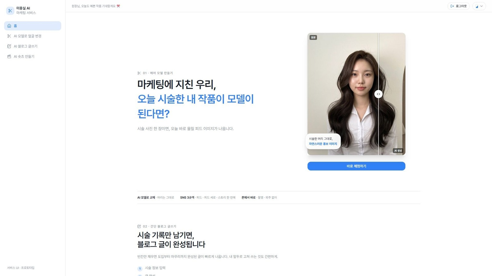
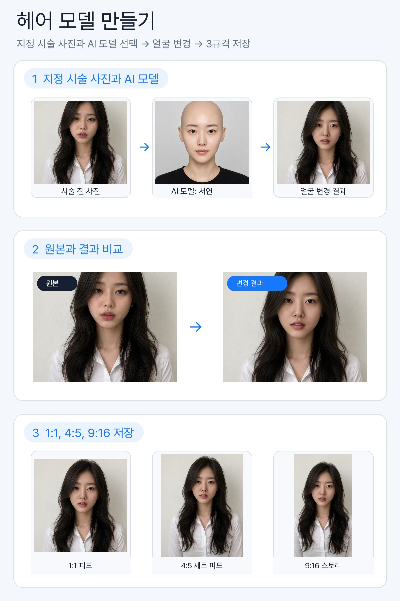
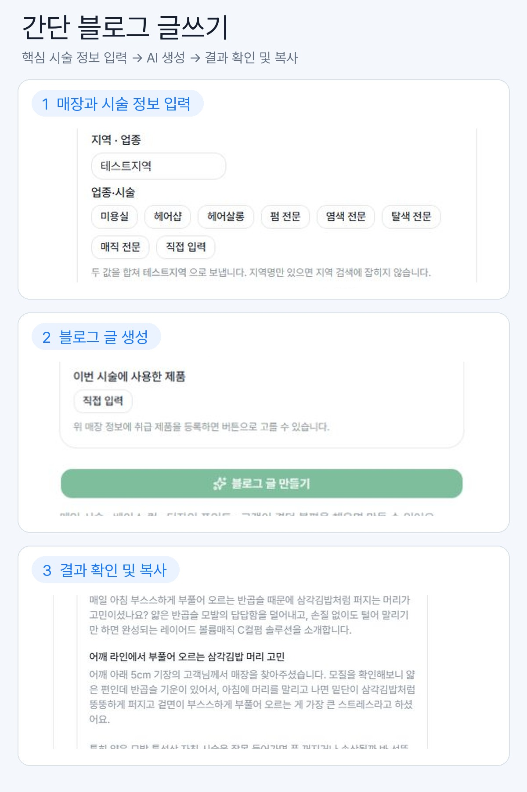
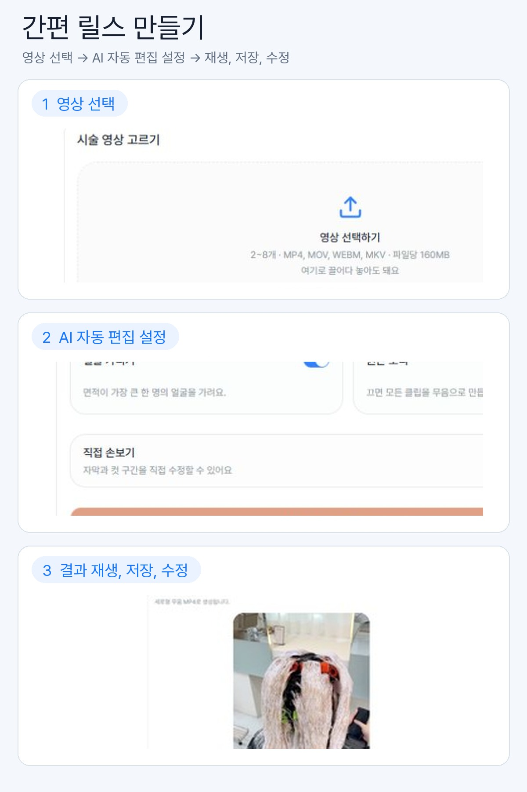
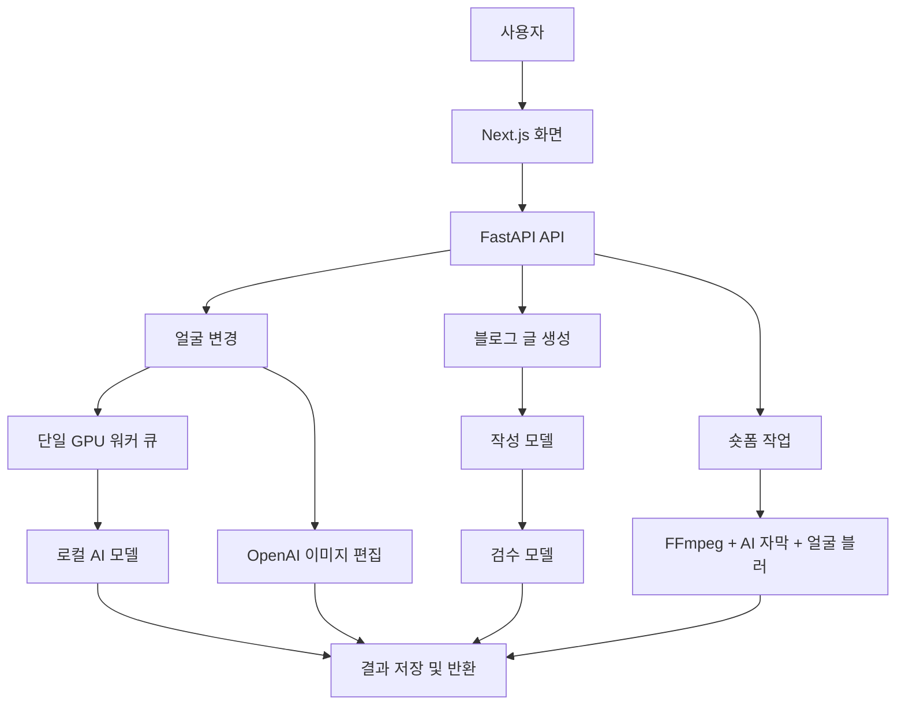

# SalonCutAI

미용실을 위한 AI 마케팅 콘텐츠 서비스입니다. 시술 사진과 영상을 올리면 사용자가 확인한 뒤 바로 활용할 수 있는 홍보 콘텐츠 초안을 만들어 줍니다.

<p>
  
  
  
  
  
  
  
  
  
  
</p>

[](https://saloncut-ai.duckdns.org)

**라이브 데모**: https://saloncut-ai.duckdns.org (프로젝트 운영 기간 동안 열려 있습니다)

## 목차

- [무엇을 하나요](#무엇을-하나요)
- [어떻게 동작하나요](#어떻게-동작하나요)
- [기술 스택](#기술-스택)
- [직접 실행해 보기](#직접-실행해-보기)
- [테스트](#테스트)
- [팀](#팀)
- [알려진 한계](#알려진-한계)
- [문서](#문서)
- [저장소 구조](#저장소-구조)

## 무엇을 하나요

미용실 홍보의 세 가지 걸림돌을 기능 하나씩으로 풉니다.

| 걸림돌 | 기능 | 결과물 |
|---|---|---|
| 고객 얼굴 때문에 시술 사진을 못 올린다 | **헤어 모델 만들기** (`/face-swap`) | 얼굴을 가상 인물로 바꾼 홍보 사진, 채널별 3규격 |
| 블로그 글쓰기는 시간과 손이 많이 간다 | **간단 블로그 글쓰기** (`/generate/blog`) | 시술 정보 입력 → 검색 키워드를 반영한 블로그 글 |
| 영상 편집을 배워야 한다 | **간편 릴스 만들기** (`/generate/shorts`) | 시술 영상 → 자막과 얼굴 블러를 포함한 9:16 숏폼 |

### 헤어 모델 만들기



### 간단 블로그 글쓰기



### 간편 릴스 만들기



## 어떻게 동작하나요

- 화면에서 요청을 보내면 백엔드가 기능에 맞는 처리 과정으로 전달합니다. 얼굴 변경은 단일 GPU 워커 큐가 순차 처리하고, 숏폼은 별도 작업으로 접수하고 CPU 인코더가 한 번에 하나씩 처리합니다. 블로그는 작성과 검수를 한 요청에서 연속 실행합니다.
- **얼굴 변경**은 두 모드입니다. 참조 얼굴 모드(가상 인물 53명 중 선택)는 서버에서 실행되는 로컬 AI 모델이 처리합니다. 프롬프트 모드(스타일 문장 지정)는 원본 전체 대신 얼굴 중심 크롭(주변 여백 포함)과 편집 마스크를 OpenAI 이미지 편집 API로 전송해 처리합니다.
- **블로그 글**은 작성 모델이 만든 글을 상위 검수 모델이 사실, 전문 용어 및 문맥의 모순을 확인하고 필요한 부분만 수정하는 2단계로 생성합니다.
- **숏폼**은 사용자가 업로드한 영상을 FFmpeg로 역할과 구간에 맞게 잘라 이어 붙이고, AI 자막과 얼굴 블러를 적용합니다. 영상 2개 이상을 올리고 생성 버튼을 누르면 기본 설정으로 초안을 만들 수 있습니다.
- 운영: GCP L4 GPU VM 1대, HTTPS(Caddy), `dev` 병합 이후 5분 주기 타이머가 검증 통과 여부를 확인한 뒤 변경된 영역만 자동 배포합니다. 배포 실패는 저장소 이슈로 자동 보고됩니다.



## 기술 스택

- 프론트엔드: Next.js, TypeScript
- 백엔드: FastAPI, Python
- AI: Stable Diffusion 계열 얼굴 변경 파이프라인(GPU), OpenAI API(이미지 편집, 텍스트 생성 및 검수), FFmpeg 영상 파이프라인
- 인프라: GCP(L4 GPU VM), Caddy, systemd 타이머 기반 자동 배포

## 직접 실행해 보기

백엔드 없이 화면 흐름만 보려면 프론트엔드만 띄우면 됩니다. API 모드를 지정하지 않으면 mock으로 동작합니다.

```bash
cd frontend
npm install
npm run dev
```

전체 실행(백엔드와 모델 포함)과 환경변수 목록은 각 폴더의 README를 참고하세요. 환경변수는 이름만 문서화하며 값은 저장소에 두지 않습니다.

- [frontend/README.md](./frontend/README.md)
- [backend/README.md](./backend/README.md)

## 테스트

- 백엔드: pytest(엔진 및 API), ruff
- 프론트엔드: lint, production build, `verify:mock`(빌드본에서 접수→폴링→결과 회귀 확인)

## 팀

<table>
  <tr>
    <td align="center" width="50%">
      <a href="https://github.com/ynow98"><br><b>노승원</b></a><br>
      PM, 기획, QA / 서빙 및 인프라 / 숏폼 기능
    </td>
    <td align="center" width="50%">
      <a href="https://github.com/Rosoomin"><br><b>노수민</b></a><br>
      이미지 생성 모델 / 얼굴 변경 백엔드와 API 연결
    </td>
  </tr>
  <tr>
    <td align="center" width="50%">
      <a href="https://github.com/qja0707"><br><b>박규범</b></a><br>
      블로그와 멀티모달 / 백엔드 공통, 인증 및 저장소 운영
    </td>
    <td align="center" width="50%">
      <a href="https://github.com/twentycherry-gif"><br><b>최혜리</b></a><br>
      서비스와 UI 화면 설계 및 구현
    </td>
  </tr>
</table>

## 알려진 한계

- 얼굴 블러는 화면에서 가장 크게 보이는 한 명에게만 자동 적용됩니다 (화면에서 안내)
- 블로그 검수는 검증한 10개 시나리오 이외의 입력에서 품질을 보장하지 않습니다
- 숏폼은 서버 메모리와 임시 저장소를 사용하므로 서버가 재시작되면 진행 중인 작업이 사라질 수 있습니다
- 얼굴 변경은 DB에 작업 상태를 저장하지만, 처리 중 서버가 재시작되면 재시도가 필요합니다
- GPU가 1장이라 모델 실험, 품질 실측과 실제 서비스를 동시에 운영하기 어렵습니다

## 문서

- **최종 보고서**: 제출본 확정 후 링크를 추가합니다 <!-- docs/ 경로 확정 후 링크 -->
- **협업일지** (GitHub Discussions):
  [노승원](https://github.com/qja0707/SalonCutAI/discussions?discussions_q=author%3Aynow98+%ED%98%91%EC%97%85%EC%9D%BC%EC%A7%80),
  [박규범](https://github.com/qja0707/SalonCutAI/discussions?discussions_q=author%3Aqja0707+%ED%98%91%EC%97%85%EC%9D%BC%EC%A7%80),
  [최혜리](https://github.com/qja0707/SalonCutAI/discussions?discussions_q=author%3Atwentycherry-gif+%ED%98%91%EC%97%85%EC%9D%BC%EC%A7%80),
  [노수민](https://github.com/qja0707/SalonCutAI/discussions?discussions_q=author%3ARosoomin+%ED%98%91%EC%97%85%EC%9D%BC%EC%A7%80)
- 파트 보고서: [블로그 글 생성](https://github.com/qja0707/SalonCutAI/discussions/202), [숏폼, 서빙 인프라 및 PM](https://github.com/qja0707/SalonCutAI/discussions/203), [서비스와 UI](https://github.com/qja0707/SalonCutAI/discussions/205), [이미지 생성과 얼굴 변경](https://github.com/qja0707/SalonCutAI/discussions/223)

## 저장소 구조

```
SalonCutAI/
├── frontend/
│   └── src/
│       ├── app/             # 라우트·화면 (face-swap, generate/blog, generate/shorts 등)
│       ├── components/      # 공통 컴포넌트 (화면 틀·단계 흐름·UI 요소)
│       └── lib/api-client/  # API 계약 레이어 (mock ↔ 실서버 전환)
├── backend/
│   └── src/
│       ├── api/             # REST API 라우터
│       ├── service/         # 비즈니스 로직
│       ├── db_session/      # DB 연결·세션
│       └── ai_engine/       # AI 파이프라인 (이미지 생성 · 텍스트 · 영상 · 평가 · 실험)
└── .github/
    ├── workflows/           # dev 검증·배포 워크플로
    ├── scripts/             # 변경 영역 감지 배포 스크립트
    └── systemd/             # VM 5분 주기 타이머 유닛
```
